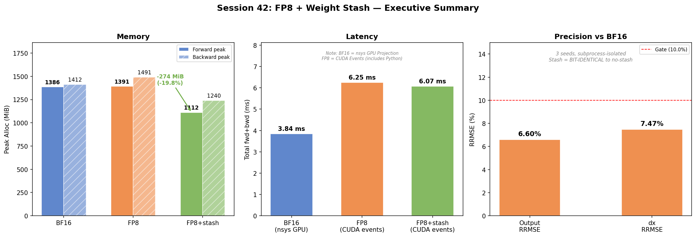
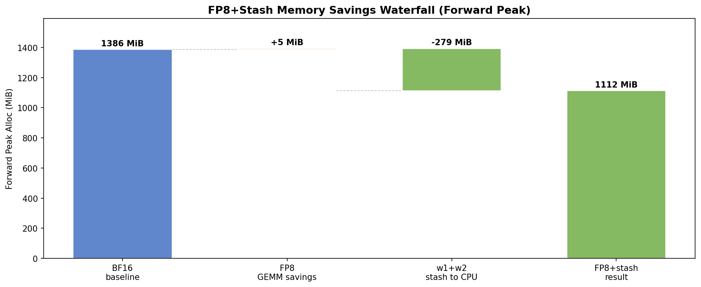
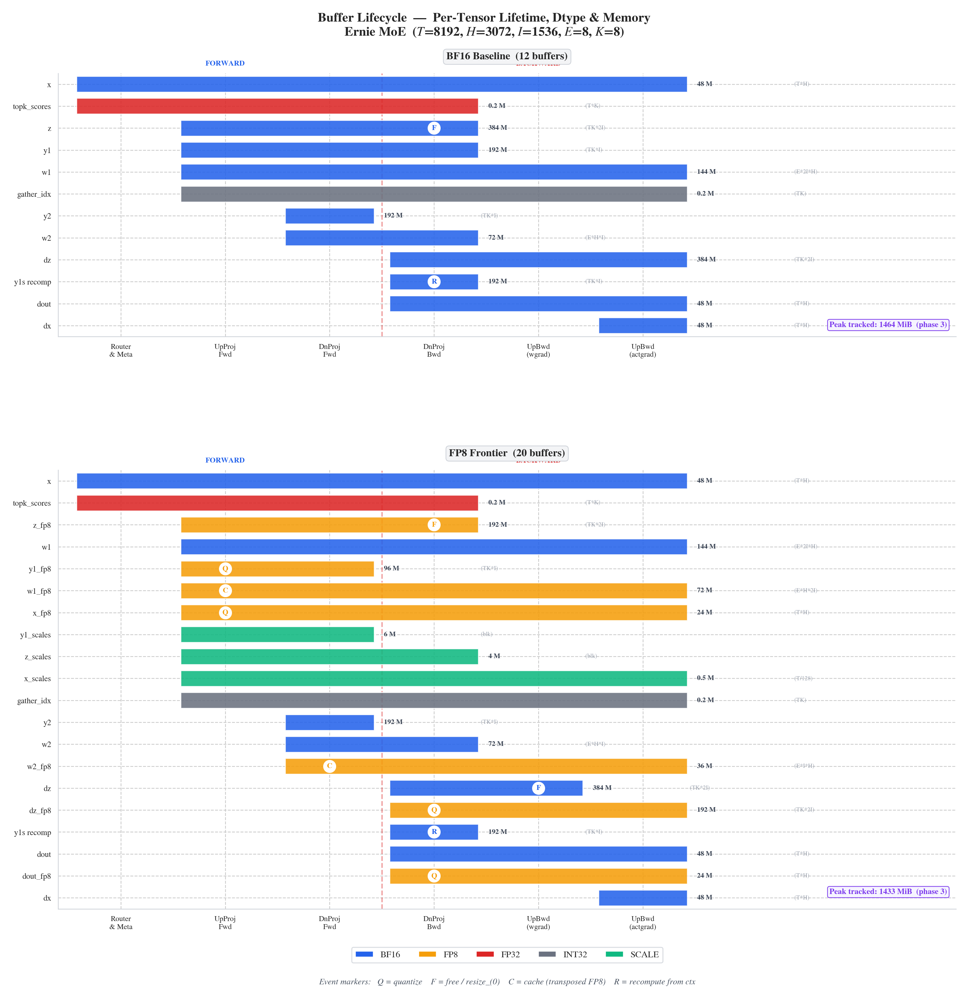
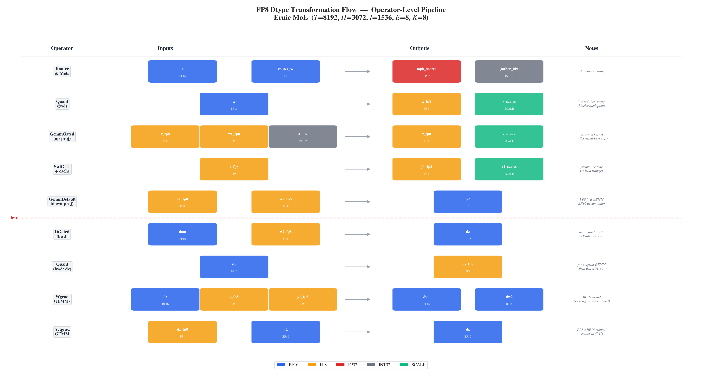
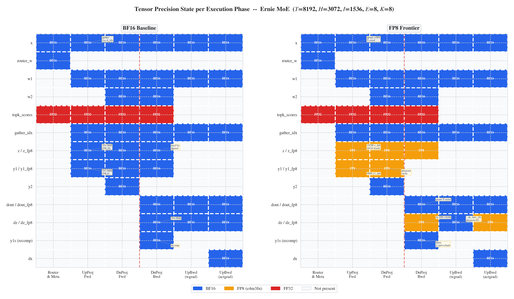
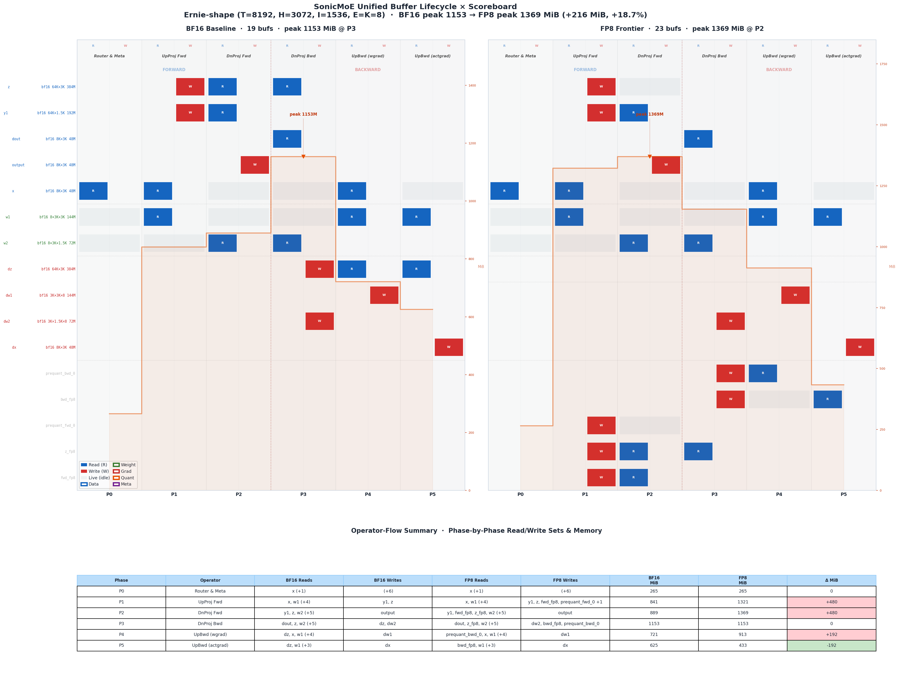

<!-- ********************************************************************************
Copyright (c) 2025, Wentao Guo, Mayank Mishra, Xinle Cheng, Ion Stoica, Tri Dao
******************************************************************************** -->

# SonicMoE: Accelerating MoE with IO and Tile-aware Optimizations
[](https://arxiv.org/abs/2512.14080)

**SonicMoE** is a simple but blazing-fast Mixture-of-Experts (MoE) implementation optimized for NVIDIA Hopper and Blackwell (beta stage) architecture GPUs. It mainly leverages [CuTeDSL](https://docs.nvidia.com/cutlass/media/docs/pythonDSL/cute_dsl_general/dsl_introduction.html) and [Triton](https://triton-lang.org/main/getting-started/tutorials/index.html) to deliver state-of-the-art performance through IO-aware optimizations. These 2 figures provide an overview of activation memory usage and training throughput. 


## 📦 Installation

### Prerequisites

- NVIDIA Hopper GPUs (H100, H200, etc.), Blackwell GPUs (GB200, B200). **For B300, please manually upgrade the triton version to 3.6.0**. We need to manually set environment variable `USE_QUACK_GEMM=1` to use the Blackwell kernels.
- CUDA 12.9+ (13.0+ for B300 GPUs)
- Python 3.12 or 3.13
- PyTorch 2.7+ (2.9.1 recommended)

### Install from pip
```bash
pip install sonic-moe
```

### Install from Source

```bash
# Clone the repository
git clone https://github.com/Dao-AILab/sonic-moe.git
cd sonic-moe

# Install dependencies
uv python install 3.13
uv venv --python 3.13
source .venv/bin/activate
pip install -r requirements.txt

# Install SonicMoE
pip install -e .
```

## 🎯 Quick Start

### Basic Usage

```python
import torch
from sonicmoe import MoE, KernelBackendMoE
from sonicmoe.enums import ActivationType

# Create MoE layer
moe = MoE(
    num_experts=128,                           # Number of experts
    num_experts_per_tok=8,                     # Top-k experts per token
    hidden_size=4096,                          # Hidden dimension
    intermediate_size=1536,                    # Expert intermediate size
    activation_function=ActivationType.SWIGLU, # SwiGLU activation
    add_bias=False,                            # Add bias to linear layers
    std=0.02,                                  # Weight initialization std
).to(device="cuda", dtype=torch.bfloat16)

# Forward pass
x = torch.randn(32768, 4096, device="cuda", dtype=torch.bfloat16)
output, aux_loss = moe(x, kernel_backend_moe=KernelBackendMoE.sonicmoe)
```

## 🧪 Testing

Run the test suite to verify correctness:

```bash
make test
```

For a Blackwell-only QuACK smoke test, run:

```bash
make test-blackwell
```

For the current Blackwell-focused regression set, run:

```bash
make test-blackwell-full
```

For an opt-in multi-process run on an idle machine, run:

```bash
make test-blackwell-parallel PYTEST_WORKERS=2
```

This parallel entry is intentionally opt-in. On a single busy GPU it may not speed up the heaviest QuACK/CuTe tests, so keep comparing it against the serial path.

On this machine, a better option is to shard the Blackwell regression files across separate GPUs:

```bash
make test-blackwell-multigpu BLACKWELL_TEST_GPUS=0,1,2
```

This avoids multiple workers contending on one GPU.

If the machine is saturated, validate the shard mapping without launching pytest:

```bash
python tools/run_blackwell_test_shards.py --gpus 0,1,2 --dry-run
```

For FP8 accuracy and memory reporting against the official bf16 baseline, run:

```bash
USE_QUACK_GEMM=1 python benchmarks/moe-cute.py --thiek 32768,2880,2880,64,8 --dtype BFloat16 --activation swiglu --skip_test --fp8_protocol blackwell --report_fp8_metrics
```

The reporting policy for every FP8 step is:

- accuracy baseline: official bf16
- memory baseline: official bf16
- performance baselines: previous commit and official bf16

## 🔥 FP8 Blockscaled Status (2026-04-09, Session 42)

The `native-fp8-exploration` branch has a fully functional **zero-materialization** blockscaled FP8 training path for Blackwell (B200) with **weight stash** memory optimization. No TK-sized FP8 activation is materialized — follows SonicMoE's core design.

### Quick Start

```python
import os
os.environ["USE_QUACK_GEMM"] = "1"
os.environ["SONIC_MOE_FP8_MODE"] = "perf"

import torch
from sonicmoe import MoE
from sonicmoe.functional.utils import enable_quack_gemm
from sonicmoe.enums import ActivationType

moe = MoE(num_experts=8, num_experts_per_tok=8, hidden_size=3072,
           intermediate_size=1536, activation_function=ActivationType.SWIGLU,
           add_bias=False, std=0.02).to(device="cuda", dtype=torch.bfloat16)

x = torch.randn(8192, 3072, device="cuda", dtype=torch.bfloat16)
with enable_quack_gemm(True):
    output, aux_loss = moe(x, use_fp8=True)
```

Only two env vars needed: `USE_QUACK_GEMM=1` and `SONIC_MOE_FP8_MODE=perf`. All other optimizations are baked into defaults.

### Performance (nsys GPU Projection, idle B200, Ernie shape T=8192 H=3072 I=1536 E=8 K=8)

| Config | GPU µs/iter | vs BF16 |
|--------|------------|---------|
| BF16 baseline | 3840 | baseline |
| **FP8 frontier** | **3442** | **1.12× faster** |

### Memory (subprocess-isolated, B200, Ernie shape)

| Metric | BF16 | FP8 | FP8 + stash | vs BF16 |
|--------|------|-----|-------------|---------|
| Forward peak | 1365 MiB | 1440 MiB | **1159 MiB** | **−206 MiB (−15.1%)** |
| Backward peak | 1343 MiB | 1492 MiB | **1239 MiB** | **−105 MiB (−7.8%)** |
| Base alloc | 489 MiB | 600 MiB | **384 MiB** | **−105 MiB (−21.4%)** |

> Backward peak fully audited: 100% accounted (1368 MiB theoretical vs 1367 measured).
> See `HANDOFF.md §1` for tensor-level breakdown.

### Precision

| Tensor | RRMSE | Cosine | Status |
|--------|-------|--------|--------|
| output | 6.60% | 0.998 | ✓ PASS |
| dx | 7.48% | 0.997 | ✓ PASS |

39/39 contract + frontier tests pass. 3 seeds, subprocess-isolated. Shadow weights BIT-IDENTICAL. FP8+stash BIT-IDENTICAL to FP8 no-stash.

### Weight Stash Training Loop

For maximum memory savings, use the weight stash API (moves bf16 master weights to CPU during fwd+bwd):

```python
optimizer.step()
moe.refresh_fp8_shadow_weights()  # bf16 → FP8 shadow caches
moe.stash_bf16_to_cpu()           # -216 MiB GPU (bf16 → CPU)
with enable_fp8():
    output, aux_loss = moe(x, use_fp8=True)
output.backward(dout)
moe.unstash_bf16()                # +216 MiB GPU (CPU → bf16)
```

> Stash is opt-in. Without it, FP8 frontier still works (saves memory via FP8 activations) but bf16 params stay on GPU.

#### Executive Summary (Session 42)



#### Memory Waterfall



### Read first

| Resource | Path | Why |
|----------|------|-----|
| **Handoff** | `reports/fp8_upgrade/HANDOFF.md` | Complete project state, bugs, measurements, next steps |
| **Benchmark report** | `reports/fp8_upgrade/FP8_BENCHMARK_REPORT.md` | Detailed performance/precision/memory analysis (Chinese) |
| Engineering log | `reports/fp8_upgrade/engineering_log.md` | Phase-by-phase development history |
| Frontier tests | `tests/fp8_large_project_contract_test.py` | 31-test correctness gate |

## 📊 Architecture & Dataflow Visualization

Ten publication-quality figures + unified scoreboard auto-generated from profiling data.
Run `python -m visualization` to regenerate all figures into `assets/`.

### Key Figures

| # | Figure | What it shows |
|---|--------|---------------|
| 1 | Executive Summary | 3-panel hero: latency (1.12×), memory (−8.8% fwd), precision (31/31 PASS) |
| 2 | Performance Waterfall | BF16 → GEMM savings → quant overhead → FP8 breakdown |
| 3 | Memory Lifecycle | 4-checkpoint BF16 vs FP8 memory trajectory |
| 4 | Backward Peak Breakdown | 100% tensor-level audit of 1367 MiB backward peak |
| 5 | Kernel-Level Comparison | Per-kernel BF16 vs FP8 timing (forward + backward) |
| 6 | Precision State Matrix | Dtype heatmap: every tensor × every phase, BF16 vs FP8 |
| 7 | Precision Profile | RRMSE + cosine similarity with pass/fail thresholds |
| 8 | Optimization Design Space | Shipped gains vs dead ends (memory impact) |
| **9** | **Buffer Lifecycle Gantt** | **Per-buffer lifetime bars, dtype-coloured, event markers, peak MiB** |
| **10** | **Dtype Transformation Flow** | **Operator-level FP8 quantization pipeline with I/O dtype boxes** |
| **11** | **Unified Scoreboard** | **Twin BF16/FP8 Gantt + memory envelope + DAG flow + operator R/W table** |

#### Buffer Lifecycle (fig 9) — per-tensor lifetime, dtype & memory


#### Dtype Transformation Flow (fig 10) — operator-level FP8 pipeline


#### Precision State Matrix (fig 6) — tensor dtype at each execution phase


#### Unified Buffer Scoreboard (fig 11) — lifecycle × operator × memory DAG


### Introspection Pipeline

The visualization suite is powered by a zero-code-change introspection engine:

```bash
# 1. Generate manifest.json (auto-extracts tensor lifecycle, memory, kernels)
python tools/introspect.py --mode trace

# 2. Generate scoreboard.json (buffer DAG + phase-state matrix)
python tools/scoreboard.py

# 3. Render all figures (reads manifest + scoreboard when available)
python -m visualization
```

## 🤝 Contributing

We welcome contributions! Please feel free to submit issues, feature requests, or pull requests.

## 📄 License

This project is licensed under the Apache License 2.0 - see the [LICENSE](LICENSE) file for details.

## 📚 Citation

If you use SonicMoE in your research, please cite:

```bibtex
@misc{guo2025sonicmoeacceleratingmoeio,
      title={SonicMoE: Accelerating MoE with IO and Tile-aware Optimizations}, 
      author={Wentao Guo and Mayank Mishra and Xinle Cheng and Ion Stoica and Tri Dao},
      year={2025},
      eprint={2512.14080},
      archivePrefix={arXiv},
      primaryClass={cs.LG},
      url={https://arxiv.org/abs/2512.14080}, 
}
```
