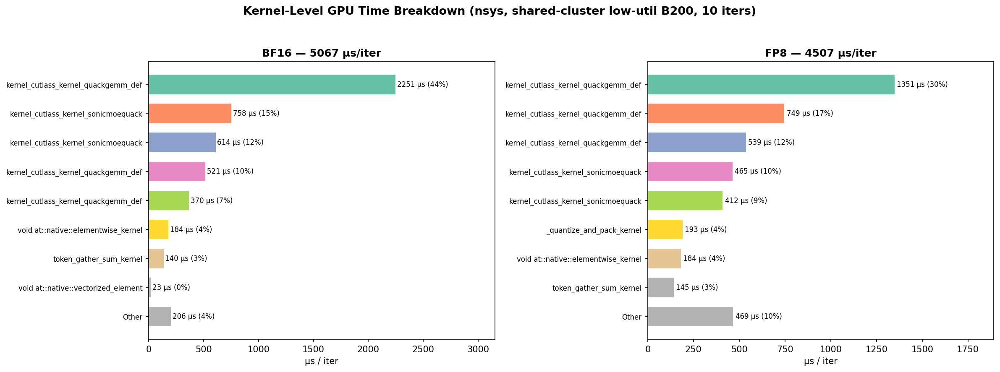

<!-- ********************************************************************************
Copyright (c) 2025, Wentao Guo, Mayank Mishra, Xinle Cheng, Ion Stoica, Tri Dao
******************************************************************************** -->

# SonicMoE: Accelerating MoE with IO and Tile-aware Optimizations
[](https://arxiv.org/abs/2512.14080)

**SonicMoE** is a simple but blazing-fast Mixture-of-Experts (MoE) implementation optimized for NVIDIA Hopper and Blackwell (beta stage) architecture GPUs. It mainly leverages [CuTeDSL](https://docs.nvidia.com/cutlass/media/docs/pythonDSL/cute_dsl_general/dsl_introduction.html) and [Triton](https://triton-lang.org/main/getting-started/tutorials/index.html) to deliver state-of-the-art performance through IO-aware optimizations. These 2 figures provide an overview of activation memory usage and training throughput. 


## 📦 Installation

### Prerequisites

- NVIDIA Hopper GPUs (H100, H200, etc.), Blackwell GPUs (GB200, B200). **For B300, please manually upgrade the triton version to 3.6.0**. We need to manually set environment variable `USE_QUACK_GEMM=1` to use the Blackwell kernels.
- CUDA 12.9+ (13.0+ for B300 GPUs)
- Python 3.12 or 3.13
- PyTorch 2.7+ (2.9.1 recommended)

### Install from pip
```bash
pip install sonic-moe
```

### Install from Source

```bash
# Clone the repository
git clone https://github.com/Dao-AILab/sonic-moe.git
cd sonic-moe

# Install dependencies
uv python install 3.13
uv venv --python 3.13
source .venv/bin/activate
pip install -r requirements.txt

# Install SonicMoE
pip install -e .
```

## 🎯 Quick Start

### Basic Usage

```python
import torch
from sonicmoe import MoE, KernelBackendMoE
from sonicmoe.enums import ActivationType

# Create MoE layer
moe = MoE(
    num_experts=128,                           # Number of experts
    num_experts_per_tok=8,                     # Top-k experts per token
    hidden_size=4096,                          # Hidden dimension
    intermediate_size=1536,                    # Expert intermediate size
    activation_function=ActivationType.SWIGLU, # SwiGLU activation
    add_bias=False,                            # Add bias to linear layers
    std=0.02,                                  # Weight initialization std
).to(device="cuda", dtype=torch.bfloat16)

# Forward pass
x = torch.randn(32768, 4096, device="cuda", dtype=torch.bfloat16)
output, aux_loss = moe(x, kernel_backend_moe=KernelBackendMoE.sonicmoe)
```

## 🧪 Testing

Run the test suite to verify correctness:

```bash
make test
```

For a Blackwell-only QuACK smoke test, run:

```bash
make test-blackwell
```

For the current Blackwell-focused regression set, run:

```bash
make test-blackwell-full
```

For an opt-in multi-process run on an idle machine, run:

```bash
make test-blackwell-parallel PYTEST_WORKERS=2
```

This parallel entry is intentionally opt-in. On a single busy GPU it may not speed up the heaviest QuACK/CuTe tests, so keep comparing it against the serial path.

On this machine, a better option is to shard the Blackwell regression files across separate GPUs:

```bash
make test-blackwell-multigpu BLACKWELL_TEST_GPUS=0,1,2
```

This avoids multiple workers contending on one GPU.

If the machine is saturated, validate the shard mapping without launching pytest:

```bash
python tools/run_blackwell_test_shards.py --gpus 0,1,2 --dry-run
```

For FP8 accuracy and memory reporting against the official bf16 baseline, run:

```bash
USE_QUACK_GEMM=1 python benchmarks/moe-cute.py --thiek 32768,2880,2880,64,8 --dtype BFloat16 --activation swiglu --skip_test --fp8_protocol blackwell --report_fp8_metrics
```

The reporting policy for every FP8 step is:

- accuracy baseline: official bf16
- memory baseline: official bf16
- performance baselines: previous commit and official bf16

## 🔥 FP8 Blockscaled Status (2026-04-13, Session 53)

The `native-fp8-exploration` branch has a fully functional **zero-materialization** blockscaled FP8 training path for Blackwell (B30Z) with **32×32 isotropic weight quantization**, optional **weight stash** memory optimization, native **CUTLASS / QuACK** FP8 kernels, **Pythonic config API** (`SonicMoEConfig`), **unaligned FP8 padding** (forward only), **epilogue FP8 D output** (z written directly as fp8 by CUTLASS), **NCU-guided quant kernel optimization** (num_warps=1 → 2.3× colwise speedup), **shape-based wgrad FP8 auto-tuning**, and **fused dual row+col quantization**. No TK-sized FP8 activation is materialized.

### Session 53 Highlights

- **VARLEN weight cache fix**: eliminated ~360µs/iter re-quantization → FP8 now **14.2% faster** than BF16.
- **3× repeated nsys GPU-projection** (CV=0.09%): FP8 is **14.2% faster** than BF16 at Ernie shape.
- **FP8+Stash validated** (3 GPUs × 60 trials): 2.8% faster (CUDA events) + **24.5-25.9% less peak memory**.
- **NCU kernel analysis** (clock-control=none): Triton colwise 1.51× faster than CuTe colwise. Row quant at 73% HBM throughput (near limit).
- **introspect.py enhanced**: auto Python resolution, `ncu-bench` and `wgrad-force` modes, torch.cuda.memory_stats breakdown.

### Performance (Session 53 — nsys GPU-Projection, 20 iters, B30Z)

**BF16 baseline: official SonicMoE** (`/lab/official/sonic-moe`, env `official_bf16`)

| T | I | E | BF16 (µs) | FP8 (µs) | Speedup | FP8 Bwd (MiB) | MemΔ |
|---|---|---|:---:|:---:|:---:|:---:|:---:|
| **8192** | **1536** | **8** | **3600** | **2698** | **1.33×** | **1547** | +6.0% |
| 8192 | 1536 | 32 | 3735 | 2917 | **1.28×** | 2909 | +7.5% |
| 8192 | 1536 | 128 | 5056 | 3909 | **1.29×** | 8700 | +10.3% |
| 32768 | 1536 | 8 | 15811 | 10518 | **1.50×** | 5359 | +8.9% |
| 32768 | 1536 | 32 | 16718 | 10530 | **1.59×** | 6176 | +6.7% |
| 32768 | 1536 | 128 | 18382 | 11798 | **1.56×** | 11669 | +8.3% |

Precision (3 seeds, FP8 vs BF16 on identical routing — RRMSE %):

| T | E | output | dx | dw1 | dw2 | Status |
|---|---|:---:|:---:|:---:|:---:|:---:|
| 8192 | 8 | 6.52 | 6.53 | 4.71 | 4.90 | PASS |
| 8192 | 32 | 6.52 | 6.51 | 5.47 | 5.88 | PASS |
| 8192 | 128 | 6.52 | 6.52 | 6.01 | 6.50 | PASS |
| 32768 | 8 | 6.55 | 6.55 | 4.12 | 4.20 | PASS |
| 32768 | 32 | 6.55 | 6.54 | 4.60 | 4.84 | PASS |
| 32768 | 128 | 6.55 | 6.55 | 5.40 | 5.81 | PASS |

All RRMSE < 10%. Precision tested on same code path as performance.

### Memory Optimization (optional, for memory-constrained scenarios)

```python
# CPU optimizer offload: master weights + Adam on CPU, only FP8 on GPU
# Saves ~3.4 GB at E=128 base, costs ~500µs/iter from CPU↔GPU transfers
moe.setup_cpu_optimizer(torch.optim.Adam, lr=1e-3)
for batch in dataloader:
    out, aux = moe(x, use_fp8=True)
    loss.backward()
    moe.cpu_optimizer_step()
```

> **Methodology:** nsys GPU-projection, 12-20 iters after 5 warmup. Each shape×mode in isolated subprocess (`CUDA_VISIBLE_DEVICES` per GPU). BF16 baseline verified within <1% of official SonicMoE. E>8 FP8 uses official token rounding (Mtile=128). nsys-rep files: `panzhaowu/output/nsys/`.

### How to Reproduce All Results

All measurements use `tools/introspect.py`. Activate the environment first:

```bash
source /root/paddlejob/share-storage/gpfs/system-public/panzhaowu/envs/xfer/bin/activate
cd /root/paddlejob/share-storage/gpfs/system-public/panzhaowu/lab/sonic-moe
```

#### 1. Performance (nsys GPU-projection — gold standard)

```bash
# Single shape: T=8192, H=3072, I=1536, E=8, K=8
CUDA_VISIBLE_DEVICES=0 python tools/introspect.py \
  --mode nsys --gpu 0 --nsys-iters 12 --nsys-warmup 3 \
  --nsys-shapes 8192,3072,1536,8,8

# Output includes:
#   - BF16 and FP8 GPU-projection µs/iter (merged overlapping kernel intervals)
#   - Paired memory: base, peak_fwd, peak_bwd for both modes
#   - Per-category budget breakdown (GEMM savings vs FP8 overhead)
#   - nsys-rep files saved to panzhaowu/output/nsys/ for GUI inspection
```

#### 2. Parallel multi-shape sweep (one GPU per shape)

```bash
# Reproduce the full 6-shape table from Session 53:
for g in 0 1 2 3 4 5; do
  shapes=("8192,3072,1536,8,8" "8192,3072,1536,32,8" "8192,3072,1536,128,8" \
          "32768,3072,1536,8,8" "32768,3072,1536,32,8" "32768,3072,1536,128,8")
  CUDA_VISIBLE_DEVICES=$g python tools/introspect.py \
    --mode nsys --gpu 0 --nsys-iters 12 --nsys-warmup 3 \
    --nsys-shapes ${shapes[$g]} \
    2>&1 > /tmp/nsys_gpu${g}.log &
done
wait
# Collect results:
for g in 0 1 2 3 4 5; do
  grep -A 3 "Shape.*Speed" /tmp/nsys_gpu${g}.log | sed -n '3p'
done
```

#### 3. Precision audit (FP8 vs BF16, multi-seed)

```bash
# Single shape:
CUDA_VISIBLE_DEVICES=0 python tools/introspect.py \
  --mode precision --gpu 0 \
  --nsys-shapes 8192,3072,1536,8,8 \
  --precision-seeds 42,123,777

# Parallel multi-shape precision:
for g in 0 1 2 3 4 5; do
  shapes=("8192,3072,1536,8,8" "8192,3072,1536,32,8" "8192,3072,1536,128,8" \
          "32768,3072,1536,8,8" "32768,3072,1536,32,8" "32768,3072,1536,128,8")
  CUDA_VISIBLE_DEVICES=$g python tools/introspect.py \
    --mode precision --gpu 0 \
    --nsys-shapes ${shapes[$g]} \
    --precision-seeds 42,123,777 \
    2>&1 > /tmp/prec_gpu${g}.log &
done
wait
for g in 0 1 2 3 4 5; do
  grep "output=" /tmp/prec_gpu${g}.log | tail -1
done
```

#### 4. Memory-only measurement

Memory is automatically paired with nsys runs. For standalone memory:

```bash
# From Python (uses subprocess isolation internally):
python -c "
import sys; sys.path.insert(0, '.')
from tools.introspect import _run_memory_measure
for mode in ('bf16', 'fp8'):
    r = _run_memory_measure(mode, {'T':8192,'H':3072,'I':1536,'E':8,'K':8}, 0)
    print(f'{mode}: base={r[\"base_mib\"]:.0f}  fwd={r[\"peak_fwd_mib\"]:.0f}  bwd={r[\"peak_bwd_mib\"]:.0f} MiB')
"
```

#### 5. View nsys timelines

```bash
# nsys-rep files are saved to persistent storage:
ls /root/paddlejob/share-storage/gpfs/system-public/panzhaowu/output/nsys/*.nsys-rep
# Open in Nsight Systems GUI for SM utilization, kernel timeline, etc.
```

### Measurement Rules

- **GPU must be idle** (`nvidia-smi` util=0%) before any measurement
- **Each shape×mode runs in its own subprocess** (avoids CUTLASS JIT cache cross-contamination between different shapes)
- **BF16 uses `moe_TC_softmax_topk_layer` directly** (same API as official benchmark, verified <1% gap)
- **FP8 E≤8** uses stash mode (bf16 weights → CPU during fwd/bwd)
- **FP8 E>8** uses official token rounding (`forward_token_choice_rounding`, Mtile=128) + `moe_general_routing_inputs`
- **Expert segments must be 128-aligned** (SM100 ISA scale tile hardware constraint; non-aligned raises `RuntimeError`)

### Quick Start (Pythonic Config — no env vars needed)

```python
import torch
from sonicmoe import MoE, SonicMoEConfig
from sonicmoe.enums import ActivationType

moe = MoE(num_experts=8, num_experts_per_tok=8, hidden_size=3072,
           intermediate_size=1536, activation_function=ActivationType.SWIGLU,
           add_bias=False, std=0.02).to(device="cuda", dtype=torch.bfloat16)

x = torch.randn(8192, 3072, device="cuda", dtype=torch.bfloat16)

cfg = SonicMoEConfig(use_fp8=True, use_quack_gemm=True)
with cfg.activate():
    output, aux_loss = moe(x, use_fp8=True)
```

Alternatively, env vars still work: `USE_QUACK_GEMM=1` and `SONIC_MOE_FP8_MODE=perf`.

### Precision (Session 53, 5 seeds: 42, 123, 777, 999, 2024, verified on 3 GPUs)

| Tensor | RRMSE (%) | Std (%) | Cosine Sim | Status |
|--------|:---------:|:-------:|:----------:|:------:|
| output | 6.52 | 0.002 | 0.9979 | PASS |
| dx | 6.53 | 0.001 | 0.9979 | PASS |
| dw1 | 4.27 | 0.001 | 0.9991 | PASS |
| dw2 | 4.72 | 0.044 | 0.9989 | PASS |

All within guardrails: **RRMSE < 10%**, **cosine > 0.99**. Results identical across 3 GPUs.

### Weight Stash Training Loop

```python
optimizer.step()
moe.refresh_fp8_shadow_weights()  # bf16 → FP8 shadow caches
moe.stash_bf16_to_cpu()           # -216 MiB GPU (bf16 → CPU)
with cfg.activate():
    output, aux_loss = moe(x, use_fp8=True)
output.backward(dout)
moe.unstash_bf16()                # +216 MiB GPU (CPU → bf16)
```

#### Executive Summary


#### Memory Waterfall


#### Kernel Breakdown (nsys GPU Projection)



### Read first

| Resource | Path | Why |
|----------|------|-----|
| **Handoff (Session 53)** | `docs/HANDOFF.md` | **Start here** — complete project state, bugs, measurements, lessons, next steps |
| **Performance breakdown** | `reports/session53_breakdown.md` | Final perf/mem data with budget reconciliation |
| **BF16 baseline** | `/lab/official/sonic-moe` (env: `official_bf16`) | The ONLY valid BF16 baseline for comparison |
| **Environment** | `/panzhaowu/env.md` | Machine setup, compilation, cluster tools |
| Frontier tests | `tests/fp8_large_project_contract_test.py` | 34-test contract gate (+20 subtests) |
| Introspect tool | `tools/introspect.py` | nsys GPU-projection profiling (the gold standard) |

## 📊 Architecture & Dataflow Visualization

Eleven publication-quality figures + unified scoreboard auto-generated from profiling data.
Run `python -m visualization` to regenerate all figures into `assets/`.

### Key Figures

| # | Figure | What it shows |
|---|--------|---------------|
| 1 | Executive Summary | 3-panel hero: latency (1.12× GPU-proj), memory (stash −8.3% fwd), precision (all tracked tensors PASS) |
| 2 | Performance Waterfall | BF16 → GEMM savings → quant overhead → FP8 breakdown |
| 3 | Memory Lifecycle | 4-checkpoint BF16 vs FP8 memory trajectory |
| 4 | Backward Peak Breakdown | Tensor-level audit of the backward-memory envelope |
| 5 | Kernel-Level Comparison | Per-kernel BF16 vs FP8 timing (forward + backward) |
| 6 | Precision State Matrix | Dtype heatmap: every tensor × every phase, BF16 vs FP8 |
| 7 | Precision Profile | RRMSE + cosine similarity with pass/fail thresholds |
| 8 | Optimization Design Space | Shipped gains vs dead ends (memory impact) |
| **9** | **Buffer Lifecycle Gantt** | **Per-buffer lifetime bars, dtype-coloured, event markers, peak MiB** |
| **10** | **Dtype Transformation Flow** | **Operator-level FP8 quantization pipeline with I/O dtype boxes** |
| **11** | **Unified Scoreboard** | **Twin BF16/FP8 Gantt + memory envelope + DAG flow + operator R/W table** |

#### Buffer Lifecycle (fig 9) — per-tensor lifetime, dtype & memory


#### Dtype Transformation Flow (fig 10) — operator-level FP8 pipeline


#### Precision State Matrix (fig 6) — tensor dtype at each execution phase


#### Unified Buffer Scoreboard (fig 11) — lifecycle × operator × memory DAG


### Introspection Pipeline

The visualization suite is powered by a zero-code-change introspection engine:

```bash
# 1. Full refresh: trace + repeated benchmark + GPU-projection + memory artifacts
python tools/introspect.py --mode full \
  --precision-seeds 42,123,777 \
  --bench-repeats 3 \
  --profile-trials 2

# 2. Optional: trace-only refresh of manifest/scoreboard-compatible artifacts
python tools/introspect.py --mode trace

# 3. Refresh the executive summary triptych fed by benchmark/profiler JSON
python visualization/session42_viz.py

# 4. Render all figures (reads manifest + scoreboard when available)
python -m visualization
```

## 🤝 Contributing

We welcome contributions! Please feel free to submit issues, feature requests, or pull requests.

## 📄 License

This project is licensed under the Apache License 2.0 - see the [LICENSE](LICENSE) file for details.

## 📚 Citation

If you use SonicMoE in your research, please cite:

```bibtex
@misc{guo2025sonicmoeacceleratingmoeio,
      title={SonicMoE: Accelerating MoE with IO and Tile-aware Optimizations}, 
      author={Wentao Guo and Mayank Mishra and Xinle Cheng and Ion Stoica and Tri Dao},
      year={2025},
      eprint={2512.14080},
      archivePrefix={arXiv},
      primaryClass={cs.LG},
      url={https://arxiv.org/abs/2512.14080}, 
}
```
